# Treasury Brain — System Flow Diagram

> **Last updated:** v3.0 (April 2026)
> **Diagram type:** `flowchart TD` — end-to-end pipeline with subgraphs per layer

```mermaid
flowchart TD

    %% ─────────────────────────────────────────
    subgraph INPUTS["📥 Data Inputs"]
        ExcelSheet["Excel Dealing Sheets\nKR Dealing · Gold Excl KRs\nSilver Bullion · Proof Coins"]
        MetalsAPI["Metals-API\nLive XAU / XAG in ZAR + USD\n15s spot poll (SPOT_POLL_INTERVAL)"]
        SettingsJSON["config/settings.json\nEntities · Provision rates\nFolders · API key"]
        ProductsJSON["config/products.json\n100+ products · oz/unit · VAT flag"]
        StoneXRecon["StoneX Recon · Stone x/build_recon.py\nMonthly account reconciliation\nOutputs: .xlsx (live formulas) + .pdf"]
        SagePDF["Sage Item Valuation Report\nMonthly physical inventory snapshot\nExtracted via pdfplumber → base_oz"]
    end

    %% ─────────────────────────────────────────
    subgraph INGESTION["📂 File Ingestion"]
        Inbox["data/inbox/\nAuto-monitored drop zone"]
        Watcher["Watcher · watcher.py\nwatchdog · detects .xlsx"]
        ManualUpload["Manual Upload\nPOST /api/upload"]
        ColdStart["Cold-Start · startup.py\nAuto-imports data/source/\nif DB is empty on launch"]
    end

    %% ─────────────────────────────────────────
    subgraph IMPORT["🔍 Importer · importer.py"]
        TabDetect["Detect Deal Tabs\nkeywords: gold · silver · kr · dealing"]
        ColourClassify{"Row Fill\nColour?"}
        OrangeRow["🟠 Orange FFC000\nConfirmed Deal"]
        YellowRow["🟡 Yellow FFD700\nQuote / Pipeline"]
        BlueRow["🔵 Blue\nProof Coin"]
        WhiteRow["⬜ White / Empty\nSkip"]
        ColumnLayout{"Tab Layout"}
        KRLayout["KR layout\nBuy: cols A–N · Sell: cols O–AA"]
        StdLayout["Standard layout\nBuy: cols A–P · Sell: cols Q–AE"]
        ExtractFields["Extract Fields\ndate · dealer · product_code\nunits · oz · spot · margin%\nchannel · silo · movement"]
        ProductLookup["products.json lookup\noz_per_unit · VAT treatment\nValidate: oz = units × oz/unit"]
    end

    %% ─────────────────────────────────────────
    subgraph CALC["⚙️ Calculation Engine · processor.py"]
        InventoryCheck{"Current\nInventory oz"}
        NoProvision["No Provision\nInventory ≥ 0 · company owns stock"]
        Provision["Provision Active\nGold 4.5% · Silver 8%\nInventory < 0 · company is short"]
        SellGP["Sell GP\nprofit% = margin% − provision%"]
        BuyGP["Buy GP\nprofit% = provision% − margin%"]
        GPCalc["GP Contribution\nprofit% × notional deal value ZAR"]
        VWAPCalc["Running VWAP\nΣ(oz × price) ÷ Σ(oz)\nMargin VWAP = Σ(margin×oz) ÷ Σ(oz)\nNEVER simple mean"]
        FlipCheck["Provision Flip?\nDid deal cross inventory through zero?"]
        DedupHash["MD5 Dedup Check\nhash of entity·metal·type·date\ndealer·product·units·spot·margin"]
    end

    %% ─────────────────────────────────────────
    subgraph DATABASE["🗄️ SQLite Databases\nv2.0: AppData/Local/TreasuryBrain/treasury.db\nv3.0: AppData/Local/TreasuryBrain_v3/treasury.db"]
        DealsTable[("deals\nFull confirmed transaction ledger")]
        PipelineTable[("pipeline\nQuotes awaiting confirmation")]
        InventoryTable[("inventory\nBase oz per entity + metal\nSet from Sage PDF via seed_positions.py\nGold: -450.331 oz · Silver: -2762.330 oz\nLive oz = base + Σbuys − Σsells")]
        AgeingTable[("inventory_ageing\nParcel-level dormancy tracking")]
        HedgingTable[("hedging\nLong / short futures positions\nStone X · SAM · Proofs\nOpen price in ZAR (USD legs converted)")]
        SpotTable[("spot_prices\nHistorical XAU / XAG ZAR log")]
        SummaryTable[("daily_summary\nPre-calculated cache")]
    end

    %% ─────────────────────────────────────────
    subgraph FIFO["🔁 FIFO Daily Book Engine · /api/exposure"]
        EventTimeline["Build Event Timeline\nPhysical buys → long events\nPhysical sells → short events\nHedge longs → long events\nHedge shorts → short events"]
        DailyGroup["Group by Date\nSort chronologically"]
        FIFOMatch["FIFO Match Each Day\nAdd today's longs + shorts to carry queues\nPop fronts of both queues until one exhausted\nRecord matched pairs: (buy_price, sell_price, oz)"]
        Carryforward["Carry Forward\nUnmatched positions → next day's book\nAffects next day's VWAP"]
        RealizedAlpha["Treasury Alpha\nΣ (sell_price − buy_price) × oz\nacross all matched pairs"]
        OpenBook["Open Book VWAP\nOpen Exposure VWAP = Σ(oz×price)/Σ(oz)\nacross all unmatched residual positions\n(physical + hedge combined)"]
        ClosingGP["Closing GP\nShort: (open_short_vwap − spot) × |eco_oz|\nLong:  (spot − open_long_vwap) × eco_oz\nGradient colour: pale→saturated ±R1M"]
    end

    %% ─────────────────────────────────────────
    subgraph API["🐍 Flask REST API · app.py"]
        DashAPI["GET /api/dashboard\nFull snapshot all entities × metals"]
        DealsAPI["GET /api/deals\nFiltered by entity · metal · date range"]
        InvAPI["GET /api/inventory\nBase oz + live oz (base + deal delta)\n+ aged parcels"]
        SpotAPI["GET /api/spot\nLatest prices · POST /refresh · POST /manual"]
        HedgeAPI["GET · POST · DELETE /api/hedging\nRead · add · close positions"]
        ExposureAPI["GET /api/exposure\nFIFO daily book engine\nmatched_oz · treasury_alpha\nopen_long_vwap · open_short_vwap\nopen_long_oz · open_short_oz · net_oz\n+ aggregate buy_side/sell_side for display"]
        PipeAPI["GET /api/pipeline\nQuotes + POST /:id/confirm"]
        PreviewAPI["POST /api/preview\nWhat-if deal simulator"]
        SiloAPI["GET /api/analytics/silo\nGET /api/analytics/channel\nGP breakdown"]
        InvSetAPI["POST /api/inventory/set\nManual base position override"]
        SnapAPI["GET /api/inv/snapshot\nInventory snapshot by category\nwith Sage balance recon"]
    end

    %% ─────────────────────────────────────────
    subgraph FRONTEND["🖥️ v3.0 Dashboard · dashboard.js\n30s full refresh · 15s spot-only refresh"]

        subgraph TABS["Navigation"]
            EntityTabs["Entity Tabs\nSABIS · SABI · SABGB"]
            MetalTabs["Metal Tabs\nCombined → Gold → Silver\n(Combined first)"]
            CatTabs["Category Tabs\nAll · Bullion · Proof"]
            SectionTabs["Section Tabs\nSummary · Dealing · Treasury · Inventory"]
            DateFilter["Date Filter\nAll · Today · Yesterday · Week · Month · Year · Custom"]
        end

        subgraph BANNER["Exposure Banner (always visible)"]
            ProvCard["Provision Card\nMode + rate"]
            VwapCard["Open Exposure VWAP Card\nFIFO open-book VWAP\n(physical + hedge, unmatched)\nSub: net oz · % vs spot · Closing GP\nClosing GP gradient: pale→R1M green/red"]
            NetExpCard["Net Exposure Card\nZAR value of ecosystem"]
            AlphaCard["Treasury Alpha Card\nFIFO realized alpha\nSub: oz gold/silver close out"]
            GPCard["Dealing GP Card"]
            NetGPCard["Net GP Card\nDealing GP + Treasury Alpha\n(single-metal only)"]
            CombinedCards["Combined-mode Cards\nCombined Alpha · Combined PNL"]
        end

        subgraph SECTIONS["Section Panes"]
            SummaryPane["Summary Pane\nDaily summary table\nHighlights · Charts · Target tracker"]
            DealingPane["Dealing Pane\nBuybacks card · Sales card · Dealing GP\nDeals table · Dealer breakdown\nPipeline · What-if preview\nMargin calculators · Aged inventory"]
            TreasuryPane["Treasury Pane\nHedging card (full-width)\n  Hedge VWAP (Stone X only)\n  Long/Short/Net/Ecosystem oz\nMTM Summary card\n  Weighted MTM % · total MTM\n  Best/worst position\nLive Rates card\n  Au/Ag in ZAR + USD · ZAR/USD\n  Last updated time\nPositions ledger\n  % vs hedge VWAP + % vs Open Exposure VWAP"]
            InventoryPane["Inventory Pane\nSnapshot table by product\nSage Balance column\n  Negative values in red\nRecon status column\nCategory filter (bullion/proof)"]
        end

    end

    %% ══════════════════════════════════════════
    %% FLOW CONNECTIONS
    %% ══════════════════════════════════════════

    ExcelSheet -->|"drop file"| Inbox
    ExcelSheet -->|"browser upload"| ManualUpload
    Inbox --> Watcher
    Watcher -->|"process_file()"| TabDetect
    ManualUpload -->|"process_file()"| TabDetect
    ColdStart -->|"on empty DB"| TabDetect
    SettingsJSON --> Watcher
    ProductsJSON --> ProductLookup

    TabDetect --> ColumnLayout
    ColumnLayout -->|"KR tab"| KRLayout
    ColumnLayout -->|"Gold/Silver tab"| StdLayout
    KRLayout & StdLayout --> ColourClassify
    ColourClassify -->|"Orange"| OrangeRow
    ColourClassify -->|"Yellow"| YellowRow
    ColourClassify -->|"Blue"| BlueRow
    ColourClassify -->|"White"| WhiteRow
    OrangeRow & BlueRow --> ExtractFields
    ExtractFields --> ProductLookup
    YellowRow -->|"store as-is"| PipelineTable

    ProductLookup --> InventoryCheck
    InventoryCheck -->|"≥ 0 oz"| NoProvision
    InventoryCheck -->|"< 0 oz"| Provision
    NoProvision & Provision --> SellGP & BuyGP
    SellGP & BuyGP --> GPCalc --> VWAPCalc --> FlipCheck --> DedupHash
    DedupHash -->|"new deal"| DealsTable
    DedupHash -->|"duplicate"| Skipped(["Skip"])
    DealsTable -->|"delta oz"| InventoryTable
    DealsTable -->|"new parcel"| AgeingTable

    MetalsAPI -->|"POST /api/spot/refresh"| SpotTable
    SpotTable -->|"fallback last price"| InventoryCheck

    SagePDF -->|"pdfplumber extract\noz per product code"| SeedScript["seed_positions.py\nset_inventory_position()\n+ insert_hedging_position()"]
    StoneXRecon -->|"monthly positions\nXAU/XAG oz + USD VWAP"| SeedScript
    SeedScript --> InventoryTable
    SeedScript --> HedgingTable

    DealsTable & HedgingTable --> EventTimeline
    EventTimeline --> DailyGroup --> FIFOMatch --> Carryforward
    FIFOMatch --> RealizedAlpha
    Carryforward --> OpenBook
    OpenBook --> ClosingGP

    DealsTable --> DashAPI & DealsAPI & SiloAPI
    InventoryTable --> DashAPI & InvAPI & InvSetAPI & SnapAPI
    AgeingTable --> InvAPI
    HedgingTable --> HedgeAPI & DashAPI
    PipelineTable --> PipeAPI
    SummaryTable --> DashAPI
    SpotTable --> SpotAPI & DashAPI
    RealizedAlpha & OpenBook --> ExposureAPI

    DashAPI --> SummaryPane & DealingPane
    DealsAPI --> DealingPane
    ExposureAPI --> BANNER
    InvAPI --> InventoryPane
    HedgeAPI --> TreasuryPane
    PipeAPI --> DealingPane
    PreviewAPI --> DealingPane
    SpotAPI --> VwapCard & TreasuryPane
    SiloAPI --> SummaryPane
    SnapAPI --> InventoryPane

    MetalTabs -->|"controls parallel API calls\nCombined: fetches gold + silver"| DashAPI
    DateFilter -->|"from/to params"| DealsAPI & ExposureAPI

    DealingPane -->|"POST /api/preview"| PreviewAPI
    DealingPane -->|"POST /api/pipeline/:id/confirm"| PipeAPI
    TreasuryPane -->|"POST/DELETE /api/hedging"| HedgeAPI
    InventoryPane -->|"POST /api/inventory/set"| InvSetAPI
```

---

## Key Design Decisions

| Decision | Reason |
|---|---|
| Separate DB per version | v3.0 uses `TreasuryBrain_v3` — prevents data bleed between versions during active development |
| DB in `AppData/Local` | Avoids OneDrive file-locking on shared folders |
| Row colour as status | Maps Excel visual cues directly to data classification |
| MD5 dedup fingerprint | Prevents duplicate rows on re-import |
| Provision as a rate | Every deal measured against business hurdle rate, even when inactive |
| Sage PDF as base inventory | Sage Item Valuation Report → pdfplumber → oz per product → `set_inventory_position()`. Live oz = base + Σdeals |
| FIFO daily book engine | Mirrors a trading desk book: longs matched FIFO against shorts chronologically, unmatched carry forward. Treasury alpha = realized spread on closed positions only |
| Open Exposure VWAP | FIFO unmatched book VWAP: physical + hedge combined. Distinct from Hedge VWAP (paper positions only) |
| Closing GP on VWAP card | (VWAP − spot) × eco oz — instant ZAR P&L if position closed now. Gradient colour: pale at R0, full saturation at ±R1M |
| 15s spot poll + 30s full refresh | Spot-only poll keeps VWAP card + closing GP live between full data refreshes |
| Combined tab first | User preference: Combined before Gold in metal tab order |
| VWAP everywhere | All price calculations use Σ(oz×price)/Σ(oz). Labels: "Hedge VWAP" (paper only), "Open Exposure VWAP" (full book) |
| Watcher + manual upload | Both auto-import (drop inbox) and manual upload paths supported |
| VAT split in margin calc | Silver/minted bars = 15% VAT; Krugerrands = VAT exempt (ZA tax) |
| StoneX recon workflow | Monthly statement → build_recon.py (Excel + PDF) → seed_positions.py deletes old + re-inserts reconciled positions; USD legs converted at prevailing ZAR/USD rate |
