# Treasury Brain — System Flow Diagram

> **Diagram type:** `flowchart TD` (top-down flowchart with subgraphs)
> Best fit for this project: shows the full pipeline end-to-end, handles branching (row colour classification), and groups related components clearly.

```mermaid
flowchart TD

    %% ─────────────────────────────────────────
    subgraph INPUTS["📥 Data Inputs"]
        ExcelSheet["Excel Dealing Sheets\nKR Dealing · Gold Excl KRs\nSilver Bullion · Proof Coins"]
        MetalsAPI["Metals-API\nLive XAU / XAG in ZAR"]
        SettingsJSON["config/settings.json\nEntities · Provision rates\nFolders · API key"]
        ProductsJSON["config/products.json\n100+ products\noz/unit · VAT flag"]
    end

    %% ─────────────────────────────────────────
    subgraph INGESTION["📂 File Ingestion"]
        Inbox["data/inbox/\nAuto-monitored drop zone"]
        Watcher["Watcher · watcher.py\nwatchdog · detects .xlsx"]
        ManualUpload["Manual Upload\nPOST /api/upload"]
        ColdStart["Cold-Start · startup.py\nAuto-imports data/source/\nif DB is empty on launch"]
    end

    %% ─────────────────────────────────────────
    subgraph IMPORT["🔍 Importer · importer.py"]
        TabDetect["Detect Deal Tabs\nkeywords: gold · silver · kr · dealing"]
        ColourClassify{"Row Fill\nColour?"}
        OrangeRow["🟠 Orange\nFFC000\nConfirmed Deal"]
        YellowRow["🟡 Yellow\nFFD700\nQuote / Pipeline"]
        BlueRow["🔵 Blue\nProof Coin"]
        WhiteRow["⬜ White / Empty\nSkip — header or blank"]
        ColumnLayout{"Tab Layout"}
        KRLayout["KR layout\nBuy: cols A–N\nSell: cols O–AA"]
        StdLayout["Standard layout\nBuy: cols A–P\nSell: cols Q–AE"]
        ExtractFields["Extract Fields\ndate · dealer · product_code\nunits · oz · spot · margin%\nchannel · silo · movement"]
        ProductLookup["products.json lookup\noz_per_unit · VAT treatment\nValidate: oz = units × oz/unit"]
    end

    %% ─────────────────────────────────────────
    subgraph CALC["⚙️ Calculation Engine · processor.py"]
        InventoryCheck{"Current\nInventory oz"}
        NoProvision["No Provision\nBaseline cost = 0%\nInventory ≥ 0 · company owns stock"]
        Provision["Provision Active\nGold 4.5% · Silver 8%\nInventory < 0 · company is short"]
        SellGP["Sell GP\nprofit% = margin% − provision%\nex: 6.5% sell − 4.5% prov = 2%"]
        BuyGP["Buy GP\nprofit% = provision% − margin%\nex: 4.5% prov − 2% buy = 2.5%"]
        GPCalc["GP Contribution\nprofit% × notional deal value ZAR"]
        VWAPCalc["Running VWAP\ntotal_value ÷ total_oz\nMargin VWAP = Σ(margin×oz) ÷ Σoz"]
        FlipCheck["Provision Flip?\nDid deal cross inventory\nthrough zero?"]
        DedupHash["MD5 Dedup Check\nhash of entity·metal·type·date\ndealer·product·units·spot·margin"]
    end

    %% ─────────────────────────────────────────
    subgraph DATABASE["🗄️ SQLite · treasury.db\nstored in AppData/Local to avoid OneDrive locking"]
        DealsTable[("deals\nFull confirmed transaction ledger")]
        PipelineTable[("pipeline\nQuotes awaiting confirmation")]
        InventoryTable[("inventory\nCurrent oz per entity + metal")]
        AgeingTable[("inventory_ageing\nParcel-level dormancy tracking")]
        HedgingTable[("hedging\nLong / short futures positions\nStone X · SAM · Proofs")]
        SpotTable[("spot_prices\nHistorical XAU / XAG ZAR log")]
        SummaryTable[("daily_summary\nPre-calculated cache\nbuy oz · sell oz · GP · VWAP")]
        CashFlowTable[("cash_flows\nAll money movements")]
    end

    %% ─────────────────────────────────────────
    subgraph API["🐍 Flask REST API · app.py"]
        DashAPI["GET /api/dashboard\nFull snapshot all entities × metals"]
        DealsAPI["GET /api/deals\nFiltered by entity · metal · date range"]
        InvAPI["GET /api/inventory\nPosition + aged parcels"]
        SpotAPI["GET /api/spot\nLatest prices · POST /refresh · POST /manual"]
        HedgeAPI["GET · POST · DELETE /api/hedging\nRead · add · close positions"]
        PipeAPI["GET /api/pipeline\nQuotes + POST /:id/confirm"]
        PreviewAPI["POST /api/preview\nWhat-if deal simulator"]
        SiloAPI["GET /api/analytics/silo\nGET /api/analytics/channel\nGP breakdown"]
        InvSetAPI["POST /api/inventory/set\nManual opening position"]
    end

    %% ─────────────────────────────────────────
    subgraph FRONTEND["🖥️ Dashboard · dashboard.js  (30s auto-refresh)"]
        ExposureBanner["Exposure Banner\nProvision mode + rate\nNet inventory ZAR · Total GP · Spot"]
        TradingCards["Trading Cards\nBuybacks card · Sales card\nHedging & Positions card"]
        Charts["Charts · Chart.js\nVolume by day · VWAP trend\nDaily GP · GP by Silo · GP by Channel"]
        DealsTableUI["Deals Table\nFull transaction log\nDealer · Silo · Channel · GP · Flip flag"]
        DealerTable["Dealer Breakdown\nAggregates per dealer\nDeals · oz · VWAP · GP"]
        PipelineUI["Pipeline Table\nQuotes — Confirm button\npromotes to confirmed deal"]
        PreviewUI["What-If Preview\nSimulate deal before confirm\nShows GP · cash delta · inv after · flip warning"]
        MarginCalc["Margin Calculators\nGold: KR vs Minted Bar\nSilver: 1oz coin vs Kilobar\nForward + Backward pricing · VAT"]
        AgeingUI["Aged Inventory\nDormancy flag\nExit suggestions"]
    end

    %% ══════════════════════════════════════════
    %% FLOW CONNECTIONS
    %% ══════════════════════════════════════════

    %% Inputs → Ingestion
    ExcelSheet -->|"drop file"| Inbox
    ExcelSheet -->|"browser upload"| ManualUpload
    Inbox --> Watcher
    Watcher -->|"process_file()"| TabDetect
    ManualUpload -->|"process_file()"| TabDetect
    ColdStart -->|"on empty DB\nauto-process data/source/"| TabDetect

    %% Config into importer
    SettingsJSON --> Watcher
    ProductsJSON --> ProductLookup

    %% Importer internal flow
    TabDetect --> ColumnLayout
    ColumnLayout -->|"KR tab"| KRLayout
    ColumnLayout -->|"Gold/Silver tab"| StdLayout
    KRLayout --> ColourClassify
    StdLayout --> ColourClassify
    ColourClassify -->|"Orange · FFC000"| OrangeRow
    ColourClassify -->|"Yellow · FFD700"| YellowRow
    ColourClassify -->|"Blue"| BlueRow
    ColourClassify -->|"White / empty"| WhiteRow
    OrangeRow --> ExtractFields
    BlueRow --> ExtractFields
    ExtractFields --> ProductLookup

    %% Importer → Calculator
    ProductLookup --> InventoryCheck
    YellowRow -->|"no calculation\nstore as-is"| PipelineTable

    %% Provision logic
    InventoryCheck -->|"≥ 0 oz · owns stock"| NoProvision
    InventoryCheck -->|"< 0 oz · short"| Provision
    NoProvision --> SellGP & BuyGP
    Provision --> SellGP & BuyGP
    SellGP --> GPCalc
    BuyGP --> GPCalc
    GPCalc --> VWAPCalc
    VWAPCalc --> FlipCheck
    FlipCheck --> DedupHash

    %% Dedup → DB writes
    DedupHash -->|"new deal"| DealsTable
    DedupHash -->|"duplicate"| Skipped(["Skip — already imported"])
    DealsTable -->|"delta oz"| InventoryTable
    DealsTable -->|"new parcel"| AgeingTable

    %% Spot prices
    MetalsAPI -->|"live fetch\nPOST /api/spot/refresh"| SpotTable
    SpotTable -->|"fallback last price"| InventoryCheck

    %% DB → API
    DealsTable --> DashAPI & DealsAPI
    InventoryTable --> DashAPI & InvAPI & InvSetAPI
    AgeingTable --> InvAPI
    HedgingTable --> HedgeAPI & DashAPI
    PipelineTable --> PipeAPI
    SummaryTable --> DashAPI
    SpotTable --> SpotAPI & DashAPI
    DealsTable --> SiloAPI

    %% API → Frontend
    DashAPI --> ExposureBanner & TradingCards
    DealsAPI --> DealsTableUI & Charts & DealerTable
    InvAPI --> AgeingUI
    HedgeAPI --> TradingCards
    PipeAPI --> PipelineUI
    PreviewAPI --> PreviewUI
    SpotAPI --> ExposureBanner
    SiloAPI --> Charts

    %% User actions → API (back-flows)
    PreviewUI -->|"POST /api/preview"| PreviewAPI
    PipelineUI -->|"POST /api/pipeline/:id/confirm"| PipeAPI
    AgeingUI -->|"POST /api/inventory/set"| InvSetAPI
    TradingCards -->|"POST /api/hedging"| HedgeAPI
```

---

## Key Design Decisions

| Decision | Reason |
|---|---|
| DB in `AppData/Local` | Avoids OneDrive file-locking on shared folders |
| Row colour as status | Maps Excel visual cues directly to data classification |
| MD5 dedup fingerprint | Prevents duplicate rows on re-import of the same file |
| Provision as a rate | Every deal is measured against the business hurdle rate, even when not active |
| Separate `inventory_ageing` table | Parcel-level tracking for dormancy flagging and selective exit suggestions |
| `daily_summary` cache table | Avoids re-querying hundreds of deals on every 30s dashboard refresh |
| Watcher + manual upload | Both auto-import (drop in inbox) and manual upload paths supported |
| VAT split in margin calc | Silver/minted bars = 15% VAT included; Krugerrands = VAT exempt (ZA tax treatment) |
| Hedging separate from physical | Positions tracked independently; ecosystem net = physical inventory + hedge net |
